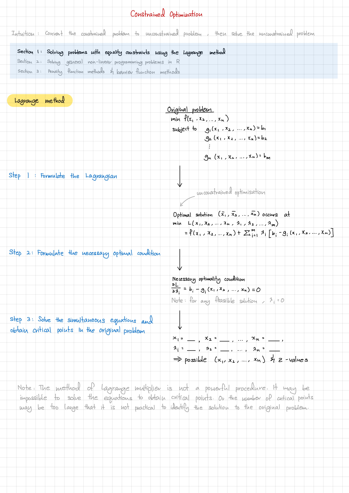

# Wang Jiayi's Notes

## BT2103 Optimization Methods in Business Analytics

_Taught by Prof. Setiono, Rudy, AY22/23 Semester 1_

    
    &nbsp;
    
    &nbsp;
    
    &nbsp;
    
    &nbsp;
    

### Concepts Covered
- [Lecture 5: Linear Programming - Duality and Graphical Solution](bt2103/5%20Linear%20Programming%20-%20Duality%20and%20Graphical%20Solution.pdf)
- [Lecture 6: Linear Programming - The Simplex Algorithm](bt2103/6%20Linear%20Programming%20-%20The%20Simplex%20Algorithm.pdf)
- [Lecture 7: Non-linear Programming - Neural Networks](bt2103/7%20Non-linear%20Programming%20-%20Neural%20Networks.pdf)
- [Lecture 8: Unconstrained Optimization](bt2103/8%20Unconstrained%20Optimization.pdf)
- [Lecture 9: Constrained Optimization](bt2103/9%20Constrained%20Optimization.pdf)

## CS2030 Programming Methodology II

_Taught by Prof. Chia Wai Kit, Henry, AY22/23 Semester 1_

### Concepts Covered
- [Lecture 11: Asynchronous Programming](cs2030/AsynchronousProgramming.java)

    Inspired by <a href="https://github.com/zhuhanming/nus-notes-cheatsheets">nus-notes-cheatsheets</a>

